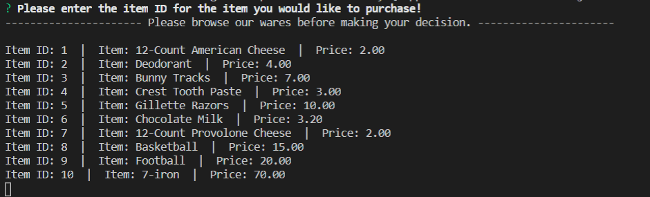
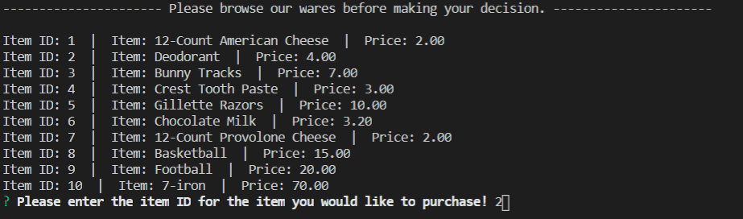
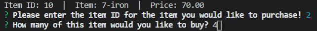
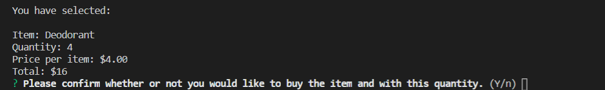
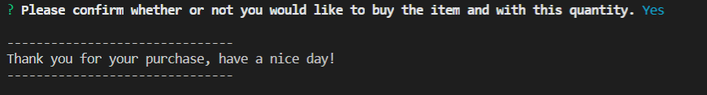
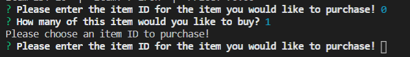
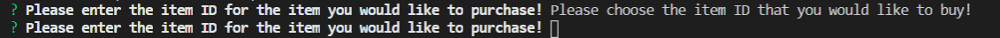

# Bamazon App

No HTML file for this project.

# Overview

In this project, an Amazon-like storefront was built using a database made through mySQL. The app takes in orders from customers and depletes the stock from the store's inventory.

# Nodes Used
● <b>inquirer</b> to ask the user questions  
● <b>mysql2</b> to connect the javascript file to the mySQL database  
● <b>validator</b> to validate what the user types in  

# Installation
First thing that is required is the installation of each of the nodes above. Go into the terminal and type  
<b>'npm init -y'</b>  
into the folder that you would like to run this file in. After this is done, you can type  
<b>'npm install name-of-node-here'</b> or <b>'npm i name-of-node-here'</b>  
for each of the nodes above, excluding mysql2, to be able to run the javascript file.

# Usage
The first thing that the user will see upon opening the terminal and running the file with the command <b>node bamazonCustomer.js</b> is a list of items that our shop is selling at this time.  
  

When the user is ready to continue on to buy one of the products listed, they can type any letter on their keyboard to bring up the next option. After typing on the user has typed something into the terminal, the next question will pop up which asks them which item ID they would like to purchase, with the inventory still being displayed above for ease of access.  
  

After the user has chosen which item they would like to purchase, they will then be prompted to choose how many of that item they would like to take home with them.  
  

The user will then be shown the item that they want to buy, how many they wanted to buy, how much each item costs, and the total amount they are required to pay for those items. A confirmation prompt was added for the user just in case they accidentally typed in the incorrect item ID.  
  

If the user types 'n' into the terminal, they will then be routed back to the inventory screen to choose the item that they meant to buy instead, and if they type 'y' they will be left with a message as they leave the store.  
  

A safeguard was added to the terminal for when the user types in '0' or nothing at all and hits enter. This will keep them from selecting an item ID and number of items as 0, it will then ask them again to type in which item and how many they would like.  
  - Stopping the user from typing 0  
  
  - Stopping the user from typing nothing   
  
